# React performance

This is RS School React course assignment.

## 🚀 Overview

React + TypeScript app that loads a large CO₂ dataset (~100 MB).

Optimized with **useMemo**, **useCallback** and **React Suspense**.

## 📊 Performance

The application was profiled with React Dev Tools before & after optimization.

### Summary

After applying `useMemo` and `useCallback` the application shows significant performance improvement in all interaction scenarios.

#### Render duration

| Interaction              | Before, ms | After, ms | Δ, ms |   Δ, % |
| ------------------------ | ---------: | --------: | ----: | -----: |
| Sorting (population asc) |       76.4 |      59.9 |  16.5 | -21.6% |
| Sorting (name desc)      |      283.3 |      54.7 | 228.6 | -80.7% |
| Searching a country      |       90.7 |      49.2 |  41.5 | -45.8% |
| Selecting a year         |      308.2 |      95.7 | 212.5 | -68.9% |
| Adding columns (+3)      |      127.2 |      83.4 |  43.8 | -34.4% |
| Removing columns (-3)    |      143.5 |      84.5 |  59.0 | -41.1% |

## Before

- ### Sorting (population asc)
  - **Commit Duration:** 77.4ms
  - **Render Duration:** 76.4ms
  - **Interaction:** User selects "Population ↑" from the sort dropdown to sort all countries by population in ascending order.
  - **Flame Graph:**  
    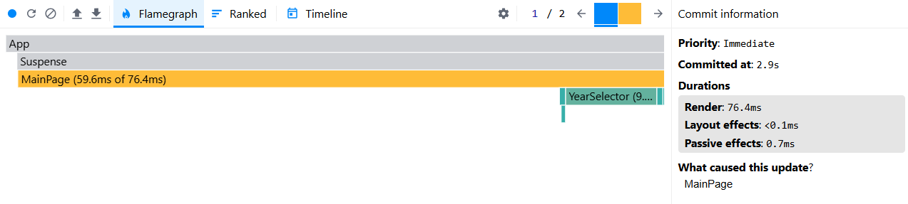
  - **Ranked Chart:**  
    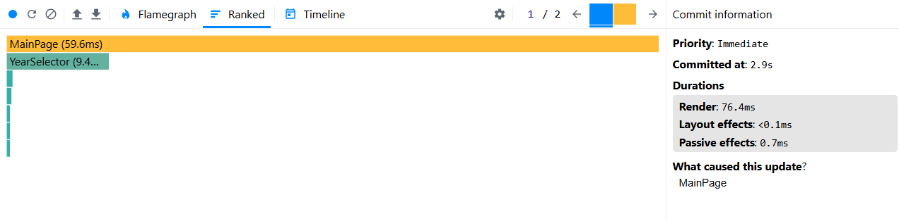

- ### Sorting (name desc)
  - **Commit Duration:** 287.5ms
  - **Render Duration:** 283.3ms
  - **Interaction:** User selects "Name ↓" from the sort dropdown to sort all countries alphabetically in descending order.
  - **Flame Graph:**  
    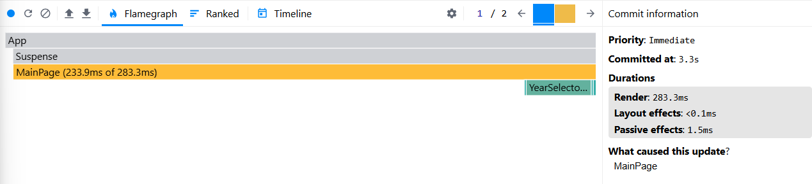
  - **Ranked Chart:**  
    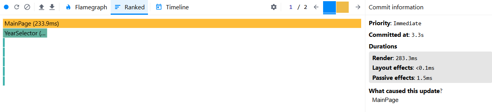

- ### Searching a country
  - **Commit Duration:** 91.7ms
  - **Render Duration:** 90.7ms
  - **Interaction:** User types a search term into the search input field and clicks the "Search" button to filter the country list.
  - **Flame Graph:**  
    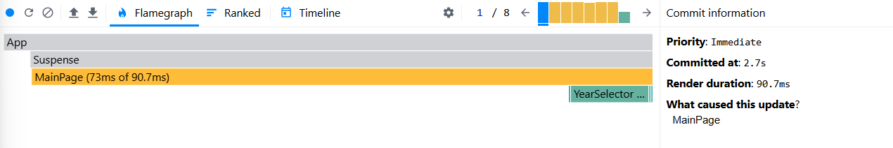
  - **Ranked Chart:**  
    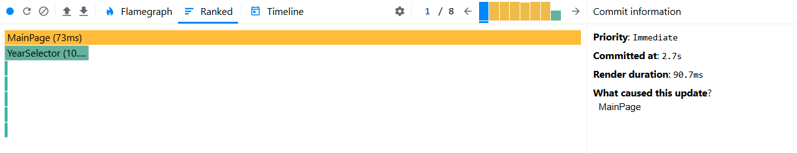

- ### Selecting a year
  - **Commit Duration:** 310.3ms
  - **Render Duration:** 308.2ms
  - **Interaction:** User selects a different year from the year dropdown to update statistics to that year.
  - **Flame Graph:**  
    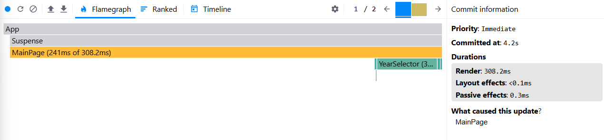
  - **Ranked Chart:**  
    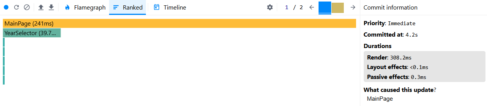

- ### Adding columns (+3)
  - **Commit Duration:** 128.2ms
  - **Render Duration:** 127.2ms
  - **Interaction:** User opens the "Select columns" modal and enables three additional optional columns in the table.
  - **Flame Graph:**  
    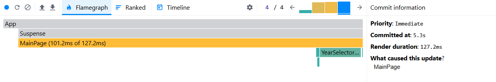
  - **Ranked Chart:**  
    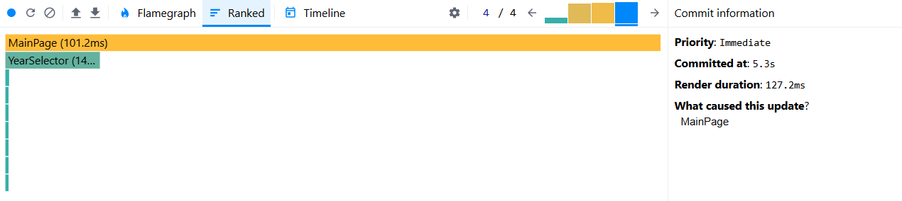

- ### Removing columns (-3)
  - **Commit Duration:** 144.6ms
  - **Render Duration:** 143.5ms
  - **Interaction:** User opens the "Select columns" modal again and disables the previously added three optional columns from the table.
  - **Flame Graph:**  
    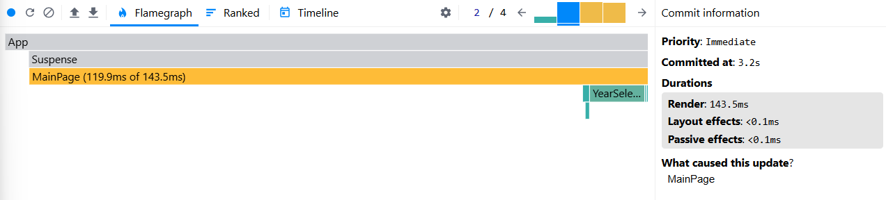
  - **Ranked Chart:**  
    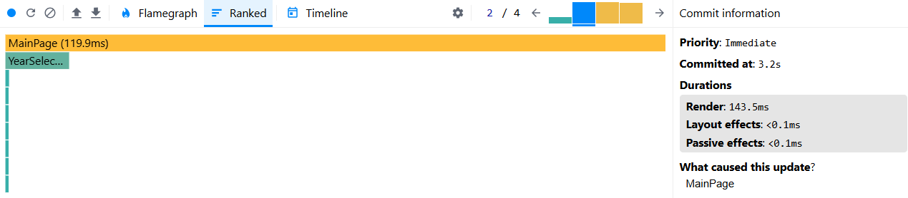

## After

- ### Sorting (population asc)
  - **Commit Duration:** 60.9ms
  - **Render Duration:** 59.9ms
  - **Interaction:** User selects "Population ↑" from the sort dropdown to sort all countries by population in ascending order.
  - **Flame Graph:**  
    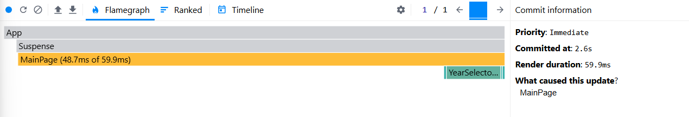
  - **Ranked Chart:**  
    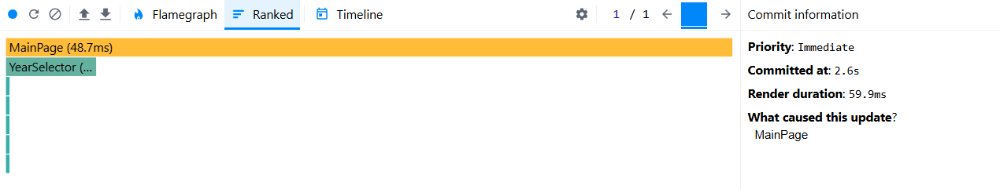

- ### Sorting (name desc)
  - **Commit Duration:** 55.6ms
  - **Render Duration:** 54.7ms
  - **Interaction:** User selects "Name ↓" from the sort dropdown to sort all countries alphabetically in descending order.
  - **Flame Graph:**  
    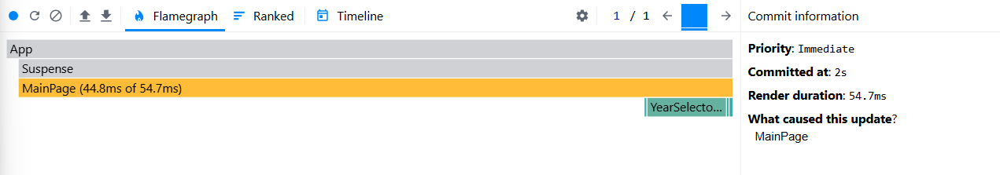
  - **Ranked Chart:**  
    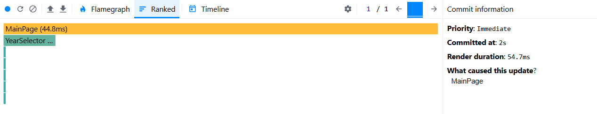

- ### Searching a country
  - **Commit Duration:** 49.9ms
  - **Render Duration:** 49.2ms
  - **Interaction:** User types a search term into the search input field and clicks the "Search" button to filter the country list.
  - **Flame Graph:**  
    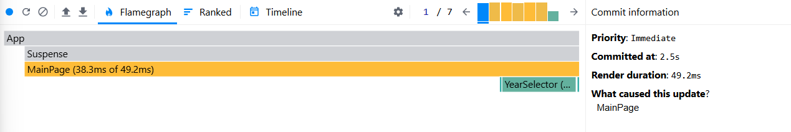
  - **Ranked Chart:**  
    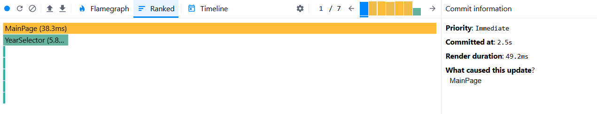

- ### Selecting a year
  - **Commit Duration:** 97.3ms
  - **Render Duration:** 95.7ms
  - **Interaction:** User selects a different year from the year dropdown to update statistics to that year.
  - **Flame Graph:**  
    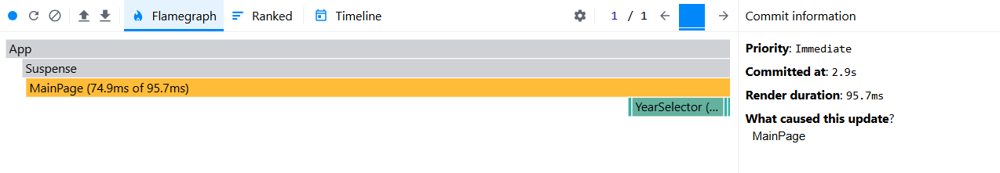
  - **Ranked Chart:**  
    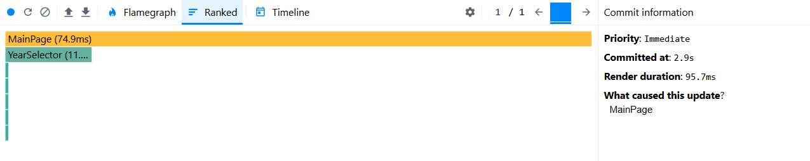

- ### Adding columns (+3)
  - **Commit Duration:** 83.9ms
  - **Render Duration:** 83.4ms
  - **Interaction:** User opens the "Select columns" modal and enables three additional optional columns in the table.
  - **Flame Graph:**  
    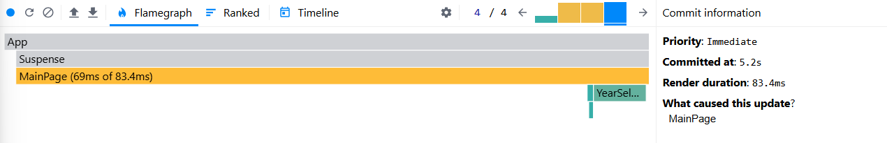
  - **Ranked Chart:**  
    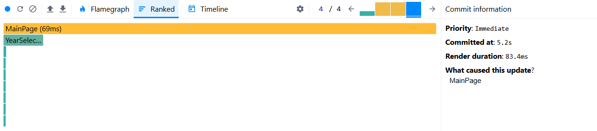

- ### Removing columns (-3)
  - **Commit Duration:** 85.1ms
  - **Render Duration:** 84.5ms
  - **Interaction:** User opens the "Select columns" modal again and disables the previously added three optional columns from the table.
  - **Flame Graph:**  
    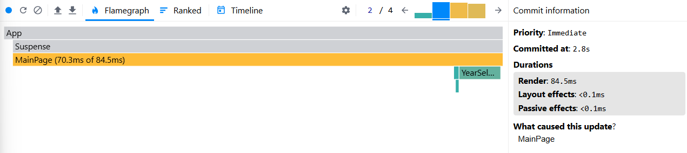
  - **Ranked Chart:**  
    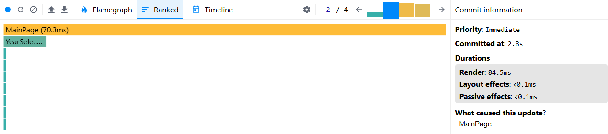
